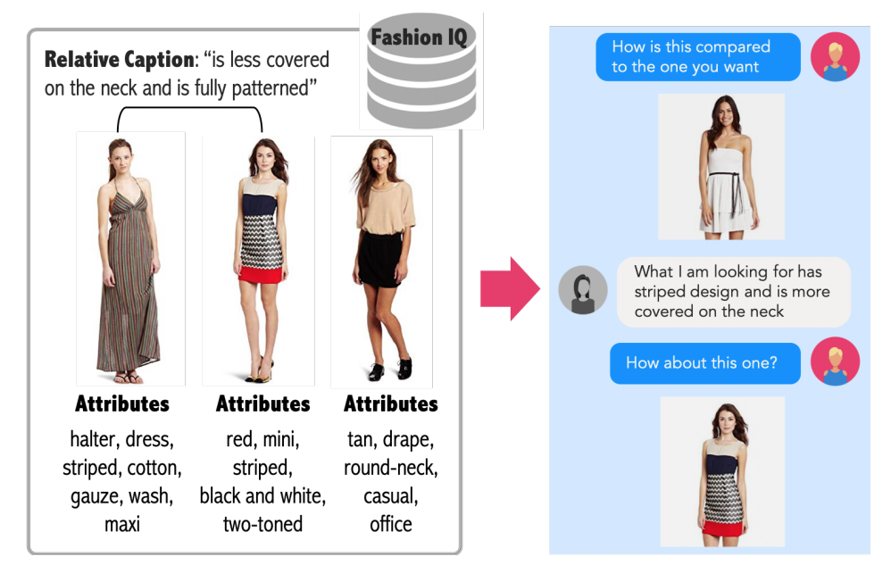
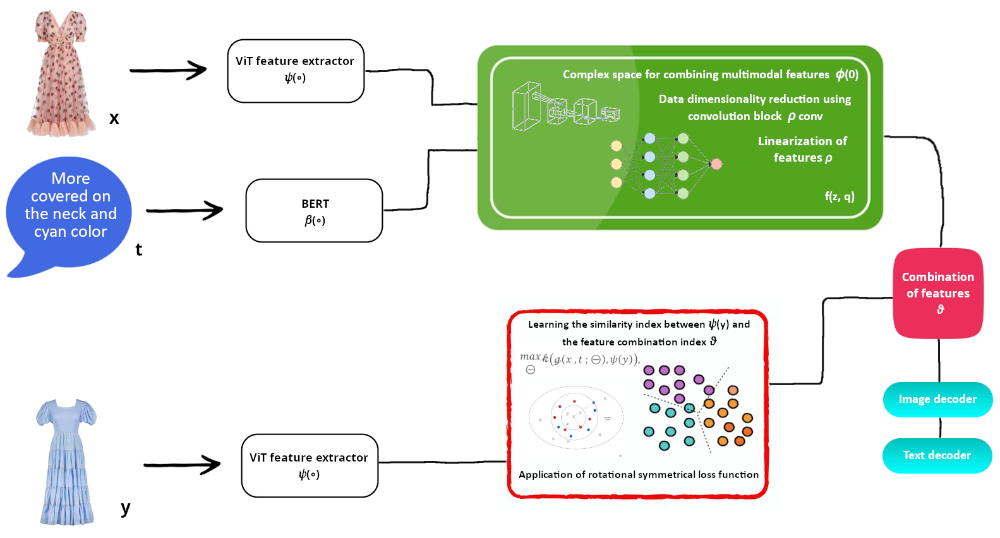

# Interactive Image Retrieval Enhanced by Content and Textual Feedback

## What's All This About?

Think about how your brain effortlessly links attributes to things. When someone says "apple," your mind instantly pictures an apple, whether it's green, red, or something in between.

Now, in the digital world, we usually search for stuff using words or images, but it's time for a twist.

## Sneak Peek



We're shaking up the way you search. Imagine blending words and pictures to find what you're looking for. That's what our project is all about. You toss in some text, and it influences the images you get back. Perfect for hunting down products online, keeping an eye on things, or finding stuff on the web.

Here's a quick example to paint the picture. Say you're shopping online and want a dress that's similar to your friend's but with some specific tweaks, like stripes and a bit more coverage. Our smart algorithm makes it happen.

## Model Magic

We've got a nifty model, powered by autoencoders and transformers, to make sense of text and images for your search. It's all about learning from the good stuff and using it to get you the perfect matches. We even throw in a sprinkle of math to keep things in check.


## Results

Our approach is able to outperform the state-of-the-art method TIRG and ComposeAE on a benchmark dataset, namely: MIT-States.

<!-- Some qualitative retrieval results are shown below: -->
<!--  -->

## Requirements and Installation

-   Packages can be found in [requirements.txt](requirements.txt)

<!-- ## Description of the Code [(From ComposeAE)](https://github.com/ecom-research/ComposeAE/blob/master/README.md) -->

## Description of the Code

The code is based on ComposeAE code.
Several significant changes have been made.

-   `main.py`: driver script to run training/testing
-   `datasets.py`: Dataset classes for loading images & generate training retrieval queries
-   `text_model.py`: LSTM model to extract text features
-   `img_text_composition_models.py`: various image text compostion models
-   `torch_function.py`: contains soft triplet loss function and feature normalization function
-   `test_retrieval.py`: functions to perform retrieval test and compute recall performance

## Running the experiments

### Download the datasets

#### MITStates dataset

Download the dataset via this [link](http://web.mit.edu/phillipi/Public/states_and_transformations/index.html) and save it in the `data` folder. Kindly take care that the dataset should have these files:

`data/processed/mitstates/images/<adj noun>/*.jpg`

#### Fashion200k dataset

Download the dataset via this [link](https://github.com/xthan/fashion-200k) and save it in the `data` folder.
To ensure fair comparison, we employ the same test queries as TIRG. They can be downloaded from [here](https://storage.googleapis.com/image_retrieval_css/test_queries.txt). Kindly take care that the dataset should have these files:

```
data/processed/fashion200k/labels/*.txt
data/processed/fashion200k/women/<category>/<caption>/<id>/*.jpeg
data/processed/fashion200k/test_queries.txt`
```

#### FashionIQ dataset

Download the dataset via this [link](https://github.com/XiaoxiaoGuo/fashion-iq) and save it in the `data` folder.
The dataset consists of three non-overlapping subsets, namely `dress`, `top-tee` and `shirt`.
We join the two annotations with the text ` and it` to get a description similar to a normal sentence a user might ask on an E-Com platform.
Furthermore, we combine the train sets of all three categories to form a bigger training set and train a single model on it.
Analogously, we also combine the validation sets to form a single validation set.

## Running the Code

For training and testing new models, pass the appropriate arguments.

For instance, for training original TIRG model on MITStates dataset run the following command:

```
python -W ignore  main.py --dataset=mitstates --dataset_path=../data/mitstates/  --model=tirg --loss=soft_triplet --learning_rate_decay_frequency=50000 --num_iters=160000 --weight_decay=5e-5 --comment=mitstates_tirg_original --log_dir ../logs/mitstates/
```

For training TIRG with BERT model on MITStates dataset run the following command:

```
python -W ignore  main.py --dataset=mitstates --dataset_path=../data/mitstates/  --model=tirg --loss=soft_triplet --learning_rate_decay_frequency=50000 --num_iters=160000 --weight_decay=5e-5 --comment=mitstates_tirg_bert --log_dir ../logs/mitstates/ --use_bert True
```

For training TIRG with complete text query on MITStates dataset run the following command:

```
python -W ignore  main.py --dataset=mitstates --dataset_path=../data/mitstates/  --model=tirg --loss=soft_triplet --learning_rate_decay_frequency=50000 --num_iters=160000 --weight_decay=5e-5 --comment=mitstates_tirg_complete_text_query --log_dir ../logs/mitstates/ --use_complete_text_query True
```

For training ComposeAE model on Fashion200k dataset run the following command:

```
python -W ignore  main.py --dataset=fashion200k --dataset_path=../data/fashion200k/  --model=composeAE --loss=batch_based_classification --learning_rate_decay_frequency=50000 --num_iters=160000 --use_bert True --use_complete_text_query True --weight_decay=5e-5 --comment=fashion200k_composeAE --log_dir ../logs/fashion200k/
```

For training RealSpaceConcatAE (ComposeAE model but with Concatenation in Real Space) on FashionIQ dataset run the following command:

```
python -W ignore  main.py --dataset=fashionIQ --dataset_path=../data/fashionIQ/  --model=RealSpaceConcatAE --loss=batch_based_classification --learning_rate_decay_frequency=8000 --num_iters=100000 --use_bert True --use_complete_text_query True --comment=fashionIQ_RealSpaceConcatAE --log_dir ../logs/fashionIQ/
```

## Notes:

### Running the BERT model

We use pretrained BERT model for encoding the text query.
Concretely, we employ BERT-as-service and use Uncased BERT-Base which outputs a 512-dimensional feature vector for a text query.
Detailed instructions on how to use it, can be found [here](https://github.com/jina-ai/clip-as-service).
It is important to note that before running the training of the models, BERT-as-service should already be running in the background.

### Monitoring Performance via tensorboard

Run the following command for monitoring loss and retrieval performance of the models:

`tensorboard --logdir ./reports/fashion200k/ --port 8898`

### Citation

If you find this code useful in your research then please cite

```
@InProceedings{,
    author    = {},
    title     = {},
    booktitle = {},
    month     = {},
    year      = {},
    pages     = {}
}
```
